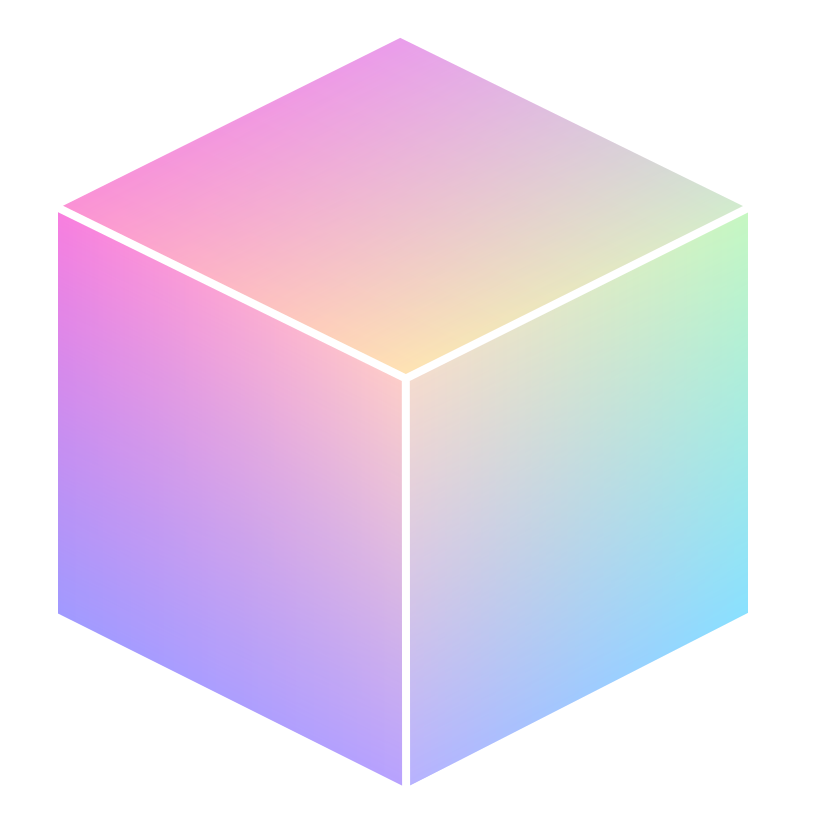
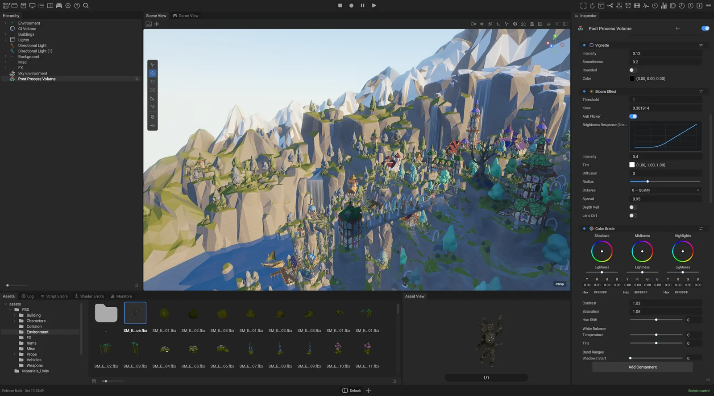
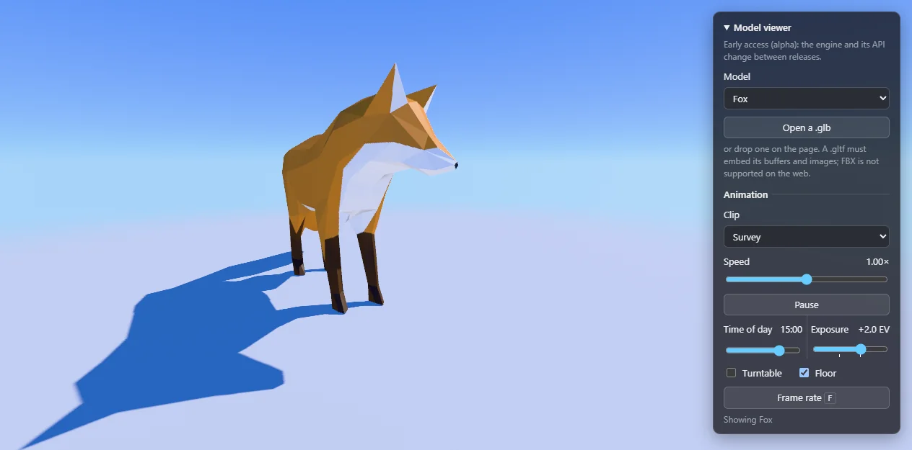

<p align="center">
  
</p>

<h1 align="center">Open Engine</h1>

A modern, high-performance, open-source game engine built for the community, by the community, with the goals of bringing power, scale, ease of use and true ownership to game developers.

It also builds for the web: the same engine runs in the browser on WebGPU, shipped as the `@openengine/web` package with live examples. Its Web API is designed to bring the capabilities and performance of the engine into an HTML canvas anywhere.

**Platforms:** Windows x64 and ARM64 (primary), macOS on Apple Silicon and Intel (native Metal renderer), Linux, Steam Deck.



## Foundation

- Open source, MIT licensed.
- A modern C++20 code base.
- Hot-reloadable C# scripting on CoreCLR (.NET 10).
- Native C++ scripting.
- A modern renderer built on Vulkan, Metal and WebGPU.
- A cross-platform editor for Windows, macOS, Linux and the web. Yes, the editor runs in the browser.
- An ECS built on a true data-oriented design.
- UI driven by CSS layout and XML, in the editor and in games.
- Built for AI-assisted development: a bundled MCP server and CLI let AI agents drive the running editor, and an in-editor AI assistant ships as a preview. See [docs/MCP_SETUP.md](docs/MCP_SETUP.md).

## Try it in the browser

Live examples, built from the engine and published with each release (WebGPU):

[](https://game-crafters-guild.github.io/opengine-web/package/examples/model-viewer/index.html)

- [Model viewer](https://game-crafters-guild.github.io/opengine-web/package/examples/model-viewer/index.html): sample models or your own `.glb`, orbit and pan, time of day, exposure, and the model's animation clips.
- [Instancing](https://game-crafters-guild.github.io/opengine-web/package/examples/instancing/index.html): one model drawn up to 100,000 times, each copy an entity.

The library behind them is [`@openengine/web`](https://www.npmjs.com/package/@openengine/web) (`npm install @openengine/web@alpha`); its README is the guide. The examples' source and the built package live in [opengine-web](https://github.com/Game-Crafters-Guild/opengine-web).

## Build

Prerequisites on Windows: Visual Studio 2026 with the *Desktop development with C++* workload (includes CMake, Ninja and Git), the .NET 10 SDK and a Vulkan-capable GPU driver.

```bat
git clone https://github.com/Game-Crafters-Guild/OpenEngine.git
cd OpenEngine
cmake --preset vs2026-x64-local
cmake --build --preset vs2026-x64-local --config DebugFast --target Editor -j 12
build\vs2026-x64-local\bin\DebugFast\Apps\Editor\Editor.exe
```

The first configure bootstraps vcpkg and builds the third-party dependencies once (expect tens of minutes); every build after that is incremental. macOS and Linux build the same Editor through their own presets (`macos-arm64-local`, `linux-x64-local`); platform prerequisites, the Ninja fast build, Steam Deck, tests and troubleshooting are in [BUILD.md](BUILD.md). With the editor running, [Your first project](docs/first-project.html) creates a project, saves a scene and exports a game.

## Repository layout

```
Engine/               The engine library: Include/, Source/, and one library per subsystem under Modules/
  ECSModules/         Shared ECS components (Audio, Components, Rendering)
Apps/Editor/          The editor (C++, with CSS/XML UI)
Apps/Player/          The game runtime the editor exports games with
Apps/WebLibrary/      The web build: the WebGPU engine module and the @openengine/web library
Managed/              C# side: CoreBridge, HotReload, Scripting.ABI, CompileServerHost
Packages/             Add-on packages: the AI assistant, version-control integrations, post effects, import tools
Assets/               Engine assets: materials, render pipelines, textures, UI, graphs
Examples/             Standalone demos (BUILD_EXAMPLES)
Tests/                Integration tests (module unit tests live next to each module)
ThirdParty/           Bundled third-party code, each with its own license
cmake/                Build scripts, presets and ports
mcp/                  The MCP server and CLI that drive a running editor
docs/                 Documentation (start at docs/index.html)
Tools/                Developer tools and scripts
dependencies/         Auto-provisioned vcpkg checkout (gitignored)
build/                Build trees, one per preset (gitignored)
```

## Community

This is an alpha: APIs and file formats may change between releases.

The engine is yours as much as ours: open issues, send pull requests, and help shape it. [CONTRIBUTING.md](CONTRIBUTING.md) and [CodingStyle.md](CodingStyle.md) say how.

Join us on Discord: https://discord.gg/c8JASm4q8

## License

MIT, see [LICENSE](LICENSE). The people behind the engine are named in [AUTHORS.md](AUTHORS.md). Third-party code keeps its own license, stated next to it: the libraries under `Engine/Source/ThirdParty/` and `ThirdParty/`, the benchmark sources under `Tools/Benchmarks/ECS/third_party/`, and the dependencies installed through vcpkg.

## Tests

Tests are Google Test executables, one per module; [BUILD.md](BUILD.md) lists how to build and run them. Two package-manager tests clone a live git repository and are skipped unless `GE_GIT_E2E=1` is set: `PackageGitResolution.LiveEndToEndAgainstGameEnginePackagesRepo` and `PackageManagementLive.AddRepinCheckAgainstGameEnginePackagesRepo`.
