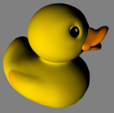

# Duck

<!-- This file is auto-generated by modelmetadata. Do not edit by hand. -->

## Tags

[core](https://github.com/KhronosGroup/glTF-Sample-Assets/blob/2bac6f8c57bf471df0d2a1e8a8ec023c7801dddf/Models/Models-core.md), [testing](https://github.com/KhronosGroup/glTF-Sample-Assets/blob/2bac6f8c57bf471df0d2a1e8a8ec023c7801dddf/Models/Models-testing.md)

## Summary

The COLLADA duck. One texture.

## Operations

* [Display](https://github.khronos.org/glTF-Sample-Viewer-Release/?model=https://raw.GithubUserContent.com/KhronosGroup/glTF-Sample-Assets/main/./Models/Duck/glTF-Binary/Duck.glb) in SampleViewer
* [Download GLB](https://raw.GithubUserContent.com/KhronosGroup/glTF-Sample-Assets/main/./Models/Duck/glTF-Binary/Duck.glb)
* [Model Directory](./)

## Screenshot

## Description

A rubber ducky bath toy.

## Legal

&copy; 2006, Sony. [SCEA Shared Source License, Version 1.0](https://spdx.org/licenses/SCEA.html)

 - Sony for Everything

<!-- This file is auto-generated by modelmetadata. Do not edit by hand. -->
